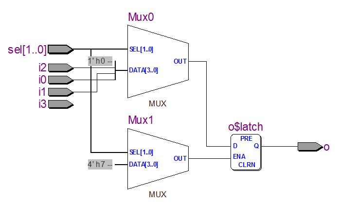
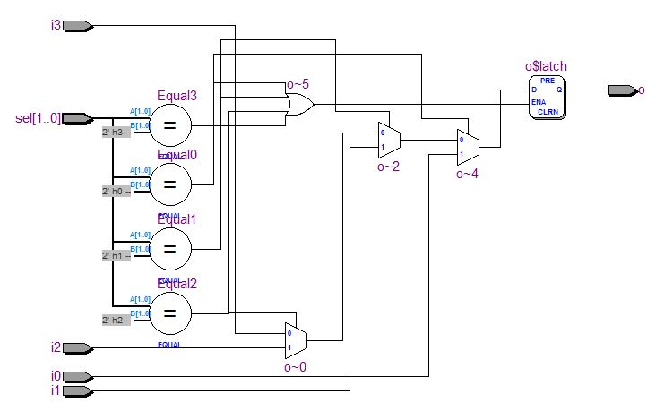

## Verilog 的電路合成研究 -- 以 MUX 多工器為例 (作者：陳鍾誠) 

雖然 Verilog 描述的是硬體，但對於沒有硬體背景的我而言，總是把它當成 C 語言來寫。但是、有時候就是會踢到鐵板，像是我設計的某幾個 CPU 在合成的時候跑超久的，放到 Altera Quartus II 裏合成，跑上半個小時都還出不來。而且有時候用 icarus 模擬都正常，但是放上 FPGA 之後執行結果就錯了。

對於這個現像，我總是百思不解，直到有人告訴我這可能和 if 有關，因為當 if 的條件沒有列完，或者沒有加上完整的 else 時，就會有 Latch 產生。

對、就是 Latch，這在「組合電路設計」上是一個很不好的情況。因為「組合電路」不應該會有內部狀態，但是當 if 或 case 語句沒有完整的「被封閉」時，就會留下某些「開放」的情況。這時候「電路合成工具」為了讓電路仍然可以運作，會加入 Latch 來處理這種「開放案例」，結果原本應該沒有狀態的組合電路就變成了「有狀態的循序電路」，這可能會造成很多奇怪的問題產生。

為了解釋何謂「未封閉的 if 會產生 Latch，我們用 Altera Quartus II 的『Tools/Netlist Viewers/RTL Viewer』合成電路檢視工具來觀察一個多工器 (MUX) 的不同寫法，並試著分析看看「未封閉的 if/case 語句會產生甚麼問題？」

### 良好案例： mux_case.v

首先、讓我們看看用 case 語法設計的多工器，程式如下所示：

檔案： mux_case.v

```verilog
module mux_case(input i0, i1, i2, i3,  input [1:0] sel, output reg o);
 always@(i0 or i1 or i2 or i3 or sel) begin
  case (sel)
    2'b00   : o = i0;
    2'b01   : o = i1;
    2'b10   : o = i2;
    default : o = i3;
  endcase
 end
endmodule
```

此時若用 RTL Viewer 去檢視，會看到下列的電路圖。


### 不良案例： mux_case_no_default.v

接著、讓我們把 case 裏的 default 拿掉，形成一個有「空洞」的程式，如下所示：

```verilog
module mux_case_no_default(input i0, i1, i2, i3,  input [1:0] sel, output reg o);
 always@(i0 or i1 or i2 or i3 or sel) begin
  case (sel)
    2'b00   : o = i0;
    2'b01   : o = i1;
    2'b10   : o = i2;
//    default : o = i3;
  endcase
 end
endmodule
```

結果、按下 Start Compilation 的按鈕後，訊息框中就多出了下列的警告訊息。

```
...
Warning (10270): Verilog HDL Case Statement warning at mux_case_no_default.v(3): incomplete case statement has no default case item

Warning (10240): Verilog HDL Always Construct warning at mux_case_no_default.v(2): inferring latch(es) for variable "o", which holds its previous value in one or more paths through the always construct
Info (10041): Inferred latch for "o" at mux_case_no_default.v(2)

Warning (13012): Latch mux_case_no_default:mux1|o has unsafe behavior

Warning (13013): Ports D and ENA on the latch are fed by the same signal sel[0]
...
```

此時若用 RTL Viewer 去檢視，會看到下列的電路圖。



### 良好案例： mux_if1.v

檔案：mux_if1.v

```verilog
module mux_if1(input i0, i1, i2, i3,  input [1:0] sel, output reg o);
 always@(i0 or i1 or i2 or i3 or sel) begin
  if (sel == 2'b00)
     o = i0;
  else if (sel == 2'b01)
     o = i1;
  else if (sel == 2'b10)
     o = i2;
  else
     o = i3;
 end
endmodule
```


### 不良案例： mux_if1_no_default.v

檔案： mux_if1_no_default.v

```verilog
module mux_if1_no_default(input i0, i1, i2, i3,  
                          input [1:0] sel, output reg o);
 always@(i0 or i1 or i2 or i3 or sel) begin
  if (sel == 2'b00)
     o = i0;
  else if (sel == 2'b01)
     o = i1;
  else if (sel == 2'b10)
     o = i2;
  else if (sel == 2'b11)
     o = i3;
 end
endmodule
```

此時若用 RTL Viewer 去檢視，會看到下列的電路圖。



### 示範影片

筆者用 Altera Quartus II 建立的一個專案，並將上述四個範例放入，一個一個用 Quartus II 分析後並用 RTL Viewer 檢視電路圖，以下是完整的教學錄影，請讀者參考。

* [YouTube : Verilog 的電路合成研究-以 MUX 多工器為例 (使用 Altera Quartus II / RTL Viewer 檢視)](http://youtu.be/8r4Ac4xueb4)

### 結語

所以、當您用 Verilog 「寫程式」的時候，請務必對 case 語法加上 default，然後對每個 if 語法都要加上 else ，這樣才能形成「封閉性良好」的程式。

當 Verilog 程式的「封閉性良好」時，合成工具才不會產生 Latch 去試圖彌補開放性的情況，也才不會讓你的組合電路變成「狀態電路」，造成電路的浪費。

更重要的是，這樣的 Verilog 程式才比較不容易出現「執行時期錯誤」或者「合成電路非常緩慢」的情況。

這是我個人慘痛經驗所換取的教訓，希望讀者不會重蹈覆轍啊！

### 參考文獻
* [真 OO无双 - 博客园: (原創) 多工器MUX coding style整理 (SOC) (Verilog) (Quartus II)](http://www.cnblogs.com/oomusou/archive/2010/09/05/verilog_mux2.html)
* [Stack Exchange : Why are inferred latches bad?](http://electronics.stackexchange.com/questions/38645/why-are-inferred-latches-bad)

【本文由陳鍾誠取材並修改自 [維基百科]，採用創作共用的 [姓名標示、相同方式分享] 授權】

