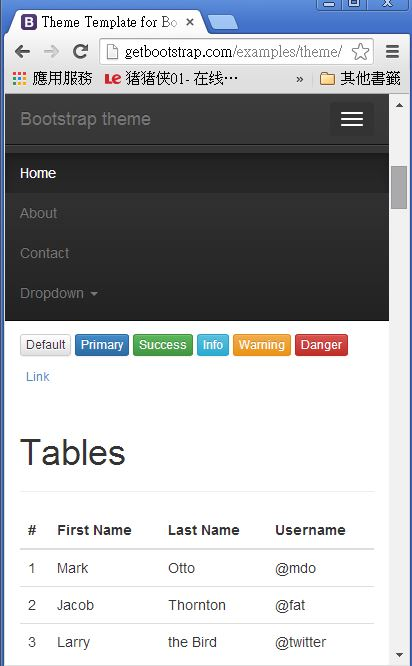

## Bootstrap 網頁排版框架

Bootstrap 是由 Twitter 釋出的「高彈性」網頁呈現框架，其程式碼主要是用 LESS 和 jQuery 所架構出來的，LESS 負責網頁排版的部份，而 jQuery 則負責動態的程式部份。

以下是一個使用 bootstrap 的最簡單網頁框架，


```html
<!DOCTYPE html>
<html lang="zh-tw">
  <head>
    <meta charset="utf-8">
    <meta http-equiv="X-UA-Compatible" content="IE=edge">
    <meta name="viewport" content="width=device-width, initial-scale=1">
    <title>Bootstrap 簡單範例！</title>

    <!-- Bootstrap -->
    <link href="css/bootstrap.min.css" rel="stylesheet">

    <!-- HTML5 Shim and Respond.js IE8 support of HTML5 elements and media queries -->
    <!-- WARNING: Respond.js doesn't work if you view the page via file:// -->
    <!--[if lt IE 9]>
      <script src="https://oss.maxcdn.com/html5shiv/3.7.2/html5shiv.min.js"></script>
      <script src="https://oss.maxcdn.com/respond/1.4.2/respond.min.js"></script>
    <![endif]-->
  </head>
  <body>
    <h1>Hello ! 您好！</h1>

    <!-- jQuery (necessary for Bootstrap's JavaScript plugins) -->
    <script src="https://ajax.googleapis.com/ajax/libs/jquery/1.11.1/jquery.min.js"></script>
    <!-- Include all compiled plugins (below), or include individual files as needed -->
    <script src="js/bootstrap.min.js"></script>
  </body>
</html>
```

在上面 bootstrap 的 HTML 檔案中，您可以注意到 CSS 被放在前面，但是 javascript 被放在最後，這是為了讓網頁顯示速度能夠最快所採用的布局，因為 javascript 若先被載入的話，就會立刻被執行，反而容易讓瀏覽器多花時間在 javascript 的載入與執行上，浪費了 CPU 與網路時間。

```html
...
    <link href="css/bootstrap.min.css" rel="stylesheet">
  </head>
	...
    <script src="js/bootstrap.min.js"></script>
  </body>
...  
```

那麼、Bootstrap 到底能做甚麼呢？讓我們看看以下的呈現範例。

範例來源： <http://getbootstrap.com/examples/theme/>


您可以看到 bootstrap 可以輕易的做出美麗有質感的「標頭列、功能表、按鈕、表格」等等功能，這簡直就是那些「對美工有障礙的程式人」所夢寐以求的神器啊！

更棒的是，如果您將上述網頁變窄一點，小一點的話，整個畫面就會變成下列樣子，您可以看到功能表和表格都還是「自動」排得很好，並沒有因為畫面變窄而亂掉，這種特性在「手機」上特別有用，因此 bootstrap 還是讓你能夠開發出「跨平台」網頁的利器喔！



以下是上述範例的「標頭列與功能表」部分的程式碼，您可以看到要寫 bootstrap 網頁通常只要用 div 元素加上 bootstrap 專有的 class 屬性就可以搞定一切了。

```html
...
    <!-- Fixed navbar -->
    <div class="navbar navbar-inverse navbar-fixed-top" role="navigation">
      <div class="container">
        <div class="navbar-header">
          <button type="button" class="navbar-toggle" data-toggle="collapse" data-target=".navbar-collapse">
            <span class="sr-only">Toggle navigation</span>
            <span class="icon-bar"></span>
            <span class="icon-bar"></span>
            <span class="icon-bar"></span>
          </button>
          <a class="navbar-brand" href="#">Bootstrap theme</a>
        </div>
        <div class="navbar-collapse collapse">
          <ul class="nav navbar-nav">
            <li class="active"><a href="#">Home</a></li>
            <li><a href="#about">About</a></li>
            <li><a href="#contact">Contact</a></li>
            <li class="dropdown">
              <a href="#" class="dropdown-toggle" data-toggle="dropdown">Dropdown <span class="caret"></span></a>
              <ul class="dropdown-menu" role="menu">
                <li><a href="#">Action</a></li>
                <li><a href="#">Another action</a></li>
                <li><a href="#">Something else here</a></li>
                <li class="divider"></li>
                <li class="dropdown-header">Nav header</li>
                <li><a href="#">Separated link</a></li>
                <li><a href="#">One more separated link</a></li>
              </ul>
            </li>
          </ul>
        </div><!--/.nav-collapse -->
      </div>
    </div>
...	
```
	
而下列的碼則是第一個表格的描述，由於 bootstrap 的設計理念是將版面寬度設定為 12 欄，因此 col-md-6 代表佔了六欄，因此在寬版的畫面中，會呈現出兩個表格並列呈現的狀況，但是在窄版的畫面中，就只會呈現出一個表格。

```html
      <div class="row">
        <div class="col-md-6">
          <table class="table">
            <thead><tr><th>#</th><th>First Name</th><th>Last Name</th><th>Username</th></tr></thead>
            <tbody>
              <tr><td>1</td><td>Mark</td><td>Otto</td><td>@mdo</td></tr>
              <tr><td>2</td><td>Jacob</td><td>Thornton</td><td>@fat</td></tr>
              <tr><td>3</td><td>Larry</td><td>the Bird</td><td>@twitter</td></tr>
            </tbody>
          </table>
        </div>
```	

當然、以上描述並不能完整的呈現 bootstrap 的功能，只是一個簡單的入門範例而已。Bootstrap 雖然以排版呈現為主，但是由於搭配了 jQuery，因此也有一些進階的函數可以使用。

另外、還有以下這些常見的控制項，像是 Nav, Navbar, Badge, Dropdown Menu, Progress Bar, Panel 等等，這些控制項的美工都設計得很好，可以「程式人」輕鬆的設計出美觀個網頁。


而且 bootstrap 在提供多欄排版上也很方便，例如下圖就是一個採用三欄排版的範例。


不過看到上述功能，我就已經受益良多了，因為我就是那種對美工毫無概念，又不想去處理「手機排版」的懶惰程式人，有了 bootstrap 之後，我想我也可以輕鬆的設計出看起來很漂亮的網站了。

### 參考文獻

* <http://getbootstrap.com/>
* [Mokoversity:Bootstrap 3 & HTML5 入門 (教學影片)](https://www.mokoversity.com/course/html5/bootstrap-html5-intro)
* [Robin Notes: 使用 Bootstrap 建置雛型網站](http://note.robinks.net/2013/10/using-bootstrap-to-build-prototype-web.html)
* [網設必備－《Bootstrap》視覺、程式都能快速上手的網頁模組](http://www.minwt.com/html/8686.html)
* [做網站非學不可的Twitter Bootstrap](http://blog.rx836.tw/blog/twitter-bootstrap/)
* [黑暗執行緒:Bootstrap!](http://blog.darkthread.net/post-2013-06-12-bootsrap-and-kendo-ui.aspx)
* [Bootstrap V2中文教學 - KKBruce](http://kkbruce.tw/)
* [Bootstrap 中文文档](http://v3.bootcss.com/)
* [Wikipedia:Bootstrap (front-end framework)]

[Wikipedia:Bootstrap (front-end framework)]:http://en.wikipedia.org/wiki/Bootstrap_(front-end_framework)


【本文由陳鍾誠取材並修改自 [維基百科]，採用創作共用的 [姓名標示、相同方式分享] 授權】

